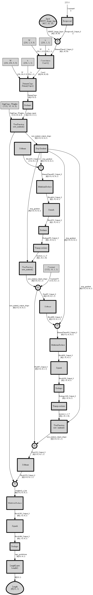
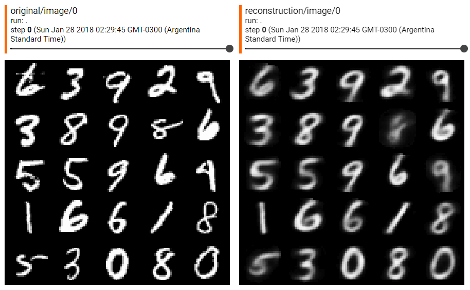

# CapsNet-CNTK

A CNTK implementation of CapsNet based on Geoffrey Hinton's paper [Dynamic Routing Between Capsules](https://arxiv.org/abs/1710.09829)

## Requeriments

- [Python](https://www.python.org/)
- [CNTK 2.3.1](https://docs.microsoft.com/en-us/cognitive-toolkit/Setup-Windows-Python?tabs=cntkpy231)
- Tensorboard (optional)

## Architecture

<a href="images/CapsNetArch.png"></a>

## Training

```
git clone https://github.com/southworkscom/CapsNet-CNTK.git
cd CapsNet-CNTK
python get_data.py
python main.py
```

### Tensorboard

To activate tensorboard, run the following command from the CapsNet-CNTK folder.

```
tensorboard --logdir tensorboard
```

Then navigate to http://localhost:6006

## Results

### Test Error

   Method     |   Routing   |   Reconstruction  |  MNIST (%)  |  *Paper*
   :---------|:------:|:---:|:----:|:----:
   Baseline |  -- | -- | --             | *0.39*
   CapsNet  |  3 | no | 0.55 | 0.35 (0.036)
   CapsNet  |  3 | yes| WIP  | 0.25 (0.005)

### Reconstruction layer

<a href="images/reconstruction.png"></a>

## TODO

- Add benchmarks
- Improve the API
- Capsule visualization